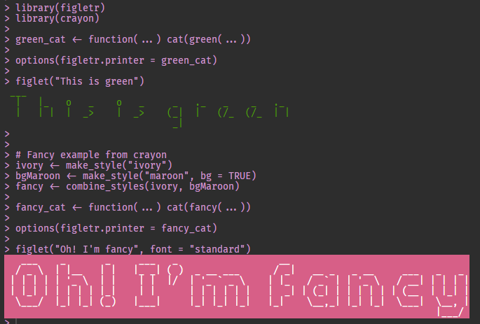

<!-- README.md is generated from README.Rmd. Please edit that file -->

```{r, include = FALSE}
knitr::opts_chunk$set(
  collapse = TRUE,
  comment = "#>",
  fig.path = "man/figures/README-",
  out.width = "100%"
)
```

# figletr

<!-- badges: start -->
<!-- badges: end -->

The goal of figletr is to write message using figlet fonts. You can also can
parse figlet fonts (*.flf files).

## Installation

You can install the released version of figletr from [CRAN](https://CRAN.R-project.org) with:

``` r
install.packages("figletr")
```

And the development version from [GitHub](https://github.com/) with:

``` r
# install.packages("devtools")
devtools::install_github("jbkunst/figletr")
```
## Simple usage

This is a basic example which shows you how to solve a common problem:

```{r example}
library(figletr)

figlet(Sys.Date())

text <- "Figlet in R!"

figlet(text)

figlet(text, "banner")

figlet(text, "contessa")

figlet(text, "smkeyboard")

figlet(text, "smisome1")

figlet(text, "speed")

figlet(text, "univers")

figlet(text, "sblood")
```

## Changing default font

```{r}
options(figletr.default_font = "mini")

figlet("Figlet in R!")

figlet("Hello")
```

## Change printer

Example: Using `cat` instead of `message`

```{r}
# message is the dafault
figlet("Figlet in R!")

options(figletr.printer = cat)

figlet("Figlet in R!")

# revert 
options(figletr.printer = message)
```

You can use the crayon package to combine cat and a color:

**This README** don't print the console colors

```{r, eval=FALSE}
library(figletr)
library(crayon)

green_cat <- function(...) cat(green(...))

options(figletr.printer = green_cat)

figlet("This is green")


# Fancy example from crayon
ivory <- make_style("ivory")
bgMaroon <- make_style("maroon", bg = TRUE)
fancy <- combine_styles(ivory, bgMaroon)

fancy_cat <- function(...) cat(fancy(...))

options(figletr.printer = fancy_cat)

figlet("Oh! I'm fancy", font = "standard")
```

```{r, echo=FALSE,  out.width = "685px"}

```


## Extra 

### Fonts

Info about available fonts:

```{r}
dplyr::glimpse(figletr::fonts)
```

### Demo

```{r, eval=FALSE}
figlet_demo(msg = "Text to test")
```


### Parser

```{r}
path_to_font <- system.file(paste0("fonts/contessa.flf"), package = "figletr")
path_to_font

font <- figletr::parse_font(path_to_font)

str(head(font))

R <- font[["R"]]

R

for(i in 1:length(R)) message(R[i])
```


