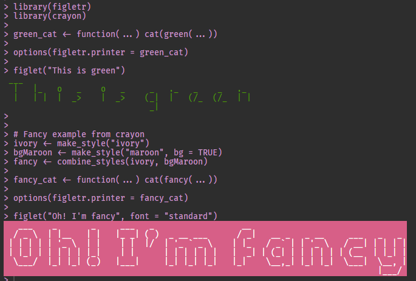

<!-- README.md is generated from README.Rmd. Please edit that file -->

# figletr

<!-- badges: start -->

<!-- badges: end -->

The goal of figletr is to write message using figlet fonts. You can also
can parse figlet fonts (\*.flf files).

## Installation

You can install the released version of figletr from
[CRAN](https://CRAN.R-project.org) with:

``` r
install.packages("figletr")
```

And the development version from [GitHub](https://github.com/) with:

``` r
# install.packages("devtools")
devtools::install_github("jbkunst/figletr")
```

## Usage

``` r
library(figletr)

figlet(Sys.Date())
#>   ____     ___    ____     ___             ___    _  _             ____     ___
#>  |___ \   / _ \  |___ \   / _ \           / _ \  | || |           |___ \   / _ \
#>    __) | | | | |   __) | | | | |  _____  | | | | | || |_   _____    __) | | (_) |
#>   / __/  | |_| |  / __/  | |_| | |_____| | |_| | |__   _| |_____|  / __/   \__, |
#>  |_____|  \___/  |_____|  \___/           \___/     |_|           |_____|    /_/
#> 

text <- "Figlet in R!"

figlet(text)
#>   _____   _           _          _       _             ____    _
#>  |  ___| (_)   __ _  | |   ___  | |_    (_)  _ __     |  _ \  | |
#>  | |_    | |  / _` | | |  / _ \ | __|   | | | '_ \    | |_) | | |
#>  |  _|   | | | (_| | | | |  __/ | |_    | | | | | |   |  _ <  |_|
#>  |_|     |_|  \__, | |_|  \___|  \__|   |_| |_| |_|   |_| \_\ (_)
#>               |___/

figlet(text, "banner")
#>  #######                                                       ######   ###
#>  #        #   ####   #       ######  #####      #  #    #      #     #  ###
#>  #        #  #    #  #       #         #        #  ##   #      #     #  ###
#>  #####    #  #       #       #####     #        #  # #  #      ######    #
#>  #        #  #  ###  #       #         #        #  #  # #      #   #
#>  #        #  #    #  #       #         #        #  #   ##      #    #   ###
#>  #        #   ####   ######  ######    #        #  #    #      #     #  ###
#> 

figlet(text, "contessa")
#> .___    .    ,         .__  |
#> [__ * _ | _ -+-  *._   [__) |
#> |   |(_]|(/, |   |[ )  |  \ *
#>      ._|

figlet(text, "smkeyboard")
#>  ____  ____  ____  ____  ____  ____  _________  ____  ____  _________  ____  ____
#> ||F ||||i ||||g ||||l ||||e ||||t ||||       ||||i ||||n ||||       ||||R ||||! ||
#> ||__||||__||||__||||__||||__||||__||||_______||||__||||__||||_______||||__||||__||
#> |/__\||/__\||/__\||/__\||/__\||/__\||/_______\||/__\||/__\||/_______\||/__\||/__\|

figlet(text, "smisome1")
#>     ___       ___       ___       ___       ___       ___            ___       ___            ___
#>    /\  \     /\  \     /\  \     /\__\     /\  \     /\  \          /\  \     /\__\          /\  \
#>   /::\  \   _\:\  \   /::\  \   /:/  /    /::\  \    \:\  \        _\:\  \   /:| _|_        /::\  \
#>  /::\:\__\ /\/::\__\ /:/\:\__\ /:/__/    /::\:\__\   /::\__\      /\/::\__\ /::|/\__\      /::\:\__\
#>  \/\:\/__/ \::/\/__/ \:\:\/__/ \:\  \    \:\:\/  /  /:/\/__/      \::/\/__/ \/|::/  /      \;:::/  /
#>     \/__/   \:\__\    \::/  /   \:\__\    \:\/  /   \/__/          \:\__\     |:/  /        |:\/__/
#>              \/__/     \/__/     \/__/     \/__/                    \/__/     \/__/          \|__|

figlet(text, "speed")
#> _______________          ______      _____        _____                ________ ______
#> ___  ____/___(_)_______ ____  /_____ __  /_       ___(_)_______        ___  __ \___  /
#> __  /_    __  / __  __ `/__  / _  _ \_  __/       __  / __  __ \       __  /_/ /__  /
#> _  __/    _  /  _  /_/ / _  /  /  __// /_         _  /  _  / / /       _  _, _/  /_/
#> /_/       /_/   _\__, /  /_/   \___/ \__/         /_/   /_/ /_/        /_/ |_|  (_)
#>                 /____/

figlet(text, "univers")
#> 
#> 88888888888  88               88                           88                   88888888ba   88
#> 88           ""               88                ,d         ""                   88      "8b  88
#> 88                            88                88                              88      ,8P  88
#> 88aaaaa      88   ,adPPYb,d8  88   ,adPPYba,  MM88MMM      88  8b,dPPYba,       88aaaaaa8P'  88
#> 88"""""      88  a8"    `Y88  88  a8P_____88    88         88  88P'   `"8a      88""""88'    88
#> 88           88  8b       88  88  8PP"""""""    88         88  88       88      88    `8b    ""
#> 88           88  "8a,   ,d88  88  "8b,   ,aa    88,        88  88       88      88     `8b   aa
#> 88           88   `"YbbdP"Y8  88   `"Ybbd8"'    "Y888      88  88       88      88      `8b  88
#>                   aa,    ,88
#>                    "Y8bbdP"

figlet(text, "sblood")
#>  @@@@@@@@ @@@  @@@@@@@  @@@      @@@@@@@@ @@@@@@@      @@@ @@@  @@@      @@@@@@@  @@@
#>  @@!      @@! !@@       @@!      @@!        @@!        @@! @@!@!@@@      @@!  @@@ @@@
#>  @!!!:!   !!@ !@! @!@!@ @!!      @!!!:!     @!!        !!@ @!@@!!@!      @!@!!@!  !@!
#>  !!:      !!: :!!   !!: !!:      !!:        !!:        !!: !!:  !!!      !!: :!!
#>   :       :    :: :: :  : ::.: : : :: :::    :         :   ::    :        :   : : :.:
#> 
```

## Changing default font

``` r
options(figletr.default_font = "mini")

figlet("Figlet in R!")
#>   _                                    _
#>  |_  o   _   |   _   _|_    o  ._     |_)  |
#>  |   |  (_|  |  (/_   |_    |  | |    | \  o
#>          _|

figlet("Hello")
#> 
#>  |_|   _   |  |   _
#>  | |  (/_  |  |  (_)
#> 
```

## Change printer

Example: Using `cat` instead of `message`

``` r
# message is the dafault
figlet("Figlet in R!")
#>   _                                    _
#>  |_  o   _   |   _   _|_    o  ._     |_)  |
#>  |   |  (_|  |  (/_   |_    |  | |    | \  o
#>          _|

options(figletr.printer = cat)

figlet("Figlet in R!")
#>   _                                    _     
#>  |_  o   _   |   _   _|_    o  ._     |_)  | 
#>  |   |  (_|  |  (/_   |_    |  | |    | \  o 
#>          _|

# revert 
options(figletr.printer = message)
```

You can use the crayon package to combine cat and a color:

**This README** don’t print the console colors

``` r
library(figletr)
library(crayon)

green_cat <- function(...) cat(green(...))

options(figletr.printer = green_cat)

figlet("This is green")


# Fancy example from crayon
ivory <- make_style("ivory")
bgMaroon <- make_style("maroon", bg = TRUE)
fancy <- combine_styles(ivory, bgMaroon)

fancy_cat <- function(...) cat(fancy(...))

options(figletr.printer = fancy_cat)

figlet("Oh! I'm fancy", font = "standard")
```



## Extra

### Fonts

Info about available fonts:

``` r
dplyr::glimpse(figletr::fonts)
#> Rows: 148
#> Columns: 8
#> $ font               <chr> "3-d", "3x5", "5lineoblique", "acrobatic", "alli...
#> $ baseline           <dbl> 8, 4, 5, 9, 7, 7, 5, 5, 7, 8, 7, 7, 7, 8, 5, 6, ...
#> $ comment_lines      <dbl> 1, 4, 2, 15, 3, 4, 12, 16, 12, 3, 3, 3, 2, 2, 23...
#> $ heigth             <dbl> 8, 6, 7, 12, 7, 7, 7, 6, 8, 8, 7, 7, 8, 8, 6, 8,...
#> $ max_length         <dbl> 20, 6, 20, 25, 26, 26, 10, 10, 54, 20, 20, 20, 2...
#> $ old_layout         <dbl> -1, -1, 15, 0, 32, 32, -1, 16, 0, -1, -1, -1, -1...
#> $ author             <chr> "Daniel Henninger", "Richard Kirk & Daniel Cabez...
#> $ font_creation_date <chr> "", "", "1995/01", "1994/08", "1994/06", "1994/0...
```

### Demo

``` r
figlet_demo(msg = "Text to test")
```

### Parser

``` r
path_to_font <- system.file(paste0("fonts/contessa.flf"), package = "figletr")
path_to_font
#> [1] "C:/Users/Joshua/Documents/R/win-library/3.6/figletr/fonts/contessa.flf"

font <- figletr::parse_font(path_to_font)

str(head(font))
#> List of 6
#>  $  : chr [1:4] "  " "  " "  " "  "
#>  $ !: chr [1:4] " | " " | " " * " "   "
#>  $ ": chr [1:4] "* * " "` ` " "    " "    "
#>  $ #: chr [1:4] "_|_|_ " "_|_|_ " " | |  " "      "
#>  $ $: chr [1:4] " _;_. " "(_|_  " "._|_) " "  `   "
#>  $ %: chr [1:4] "* / " " /  " "/ * " "    "

R <- font[["R"]]

R
#> [1] ".__ "  "[__)"  "|  \\" "    "

for(i in 1:length(R)) message(R[i])
#> .__
#> [__)
#> |  \
#> 
```

## Related work

%\>% OMG\! I swear I checked to see if there was any previous
implementation of figlet fonts in R.

  - <https://github.com/wrathematics/Rfiglet> Uses the C command line
    figlet and have a shiny app\!
  - <https://github.com/richfitz/rfiglet>

So what can this package offer?:

  - The possibily to change/fix the default font.
  - Relative simple integration with {crayon} package.
  - A figlet font parser. You can obtain a character list with every
    *character*.
